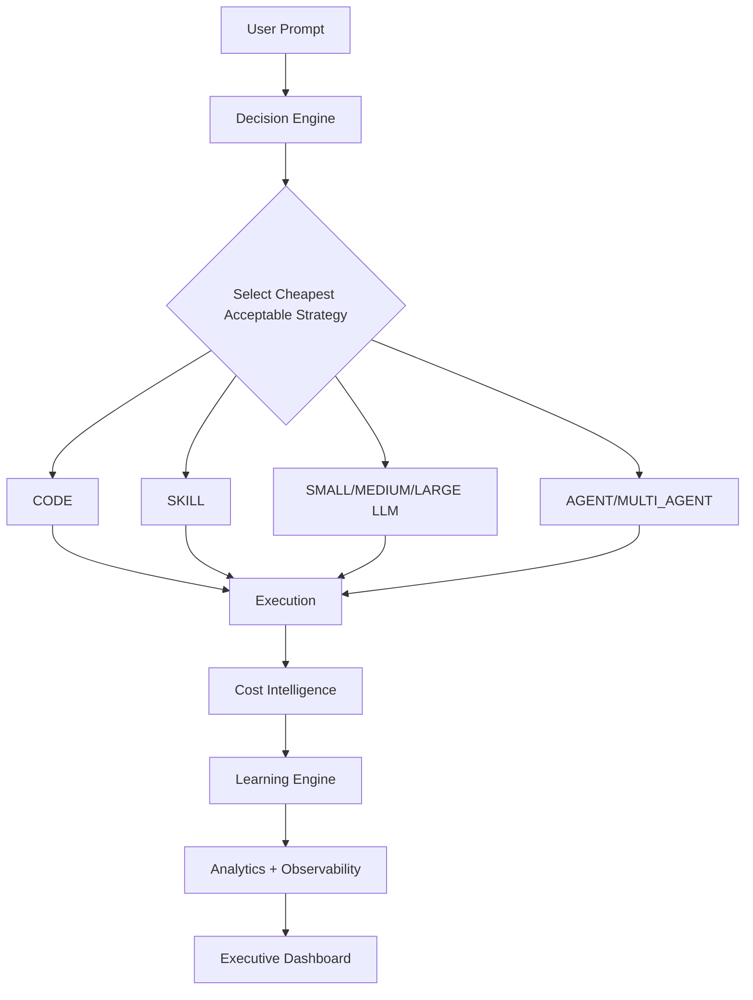
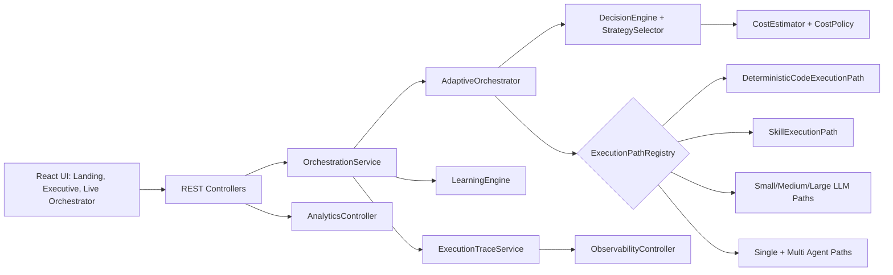
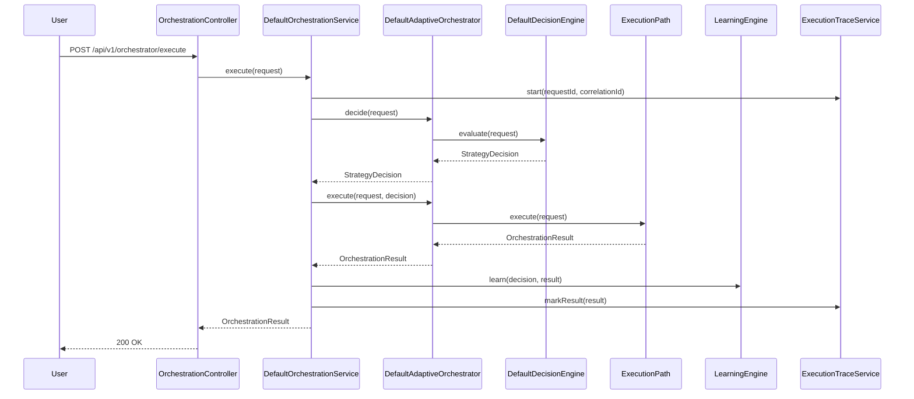

# Adaptive AI Orchestrator (AIO)

Adaptive AI Orchestrator is an enterprise routing platform that selects the **cheapest acceptable execution strategy** for each request instead of defaulting to expensive agent workflows.

## Hackathon Narrative

### Problem
Most enterprise AI platforms route too many tasks to large models or agents.  
That creates unnecessary cost, latency, and operational risk.

### Current Industry Approach
- One-size-fits-all model selection
- Agent-first execution even for simple tasks
- Limited traceability for why a route was selected

### Adaptive AI Orchestrator Approach
- Evaluate each request by complexity, reasoning depth, context size, privacy, cost, and latency
- Score all strategies
- Select the lowest-cost strategy that still meets confidence and quality constraints

### Benefits
- Lower operating cost
- Faster response time
- Better explainability and governance
- Clear demo evidence vs always-agent baselines

## Execution Strategies

- `DETERMINISTIC_CODE`
- `AI_SKILL`
- `SMALL_LLM`
- `MEDIUM_LLM`
- `LARGE_LLM`
- `SINGLE_AGENT`
- `MULTI_AGENT_WORKFLOW`

## Architecture

### End-to-End Flow



### Component Diagram



### Request Sequence



## Frontend Experience

### 1. Landing Page
Explains:
- Problem
- Current industry approach
- Adaptive orchestrator approach
- Benefits
- Cost and latency savings
- Architecture
- Demo flow
- Technology stack

### 2. Executive Dashboard
Shows:
- KPI cards (cost, latency, success, savings)
- Route distribution
- Efficiency indicators
- Timeline snapshot
- Scenario benchmark highlights

### 3. Live Orchestrator Dashboard
Includes:
- Prompt execution
- Live execution visualization
- Explainable AI panel
- Cost intelligence dashboard
- Demo center with one-click scenarios
- Timeline, learning trends, benchmark table

## API Documentation

Base URL: `http://localhost:8080/api/v1/orchestrator`

### Execute Request
- `POST /execute`

Example body:

```json
{
  "tenantId": "enterprise-tenant",
  "userId": "architect-user",
  "payload": "Draft an executive email summary",
  "metadata": {
    "category": "email",
    "difficulty": "easy"
  }
}
```

Note: Current hackathon build accepts `tenantId` and `userId` in request body for demo simplicity.  
Production roadmap moves identity to JWT/SecurityContext with tenant isolation controls.

### Analytics APIs
- `GET /analytics/summary`
- `GET /analytics/paths`
- `GET /analytics/history?limit=50`
- `GET /analytics/learning?limit=50`
- `GET /analytics/scenarios`

### Observability APIs
- `GET /observability/traces?limit=20`
- `GET /observability/traces/{requestId}`
- `GET /observability/metrics`
- `GET /actuator/health`

## Demo Center Scenarios

One-click demo scenarios:
1. Validate JSON
2. Generate SQL
3. Translate Text
4. Summarize Report
5. Draft Email
6. Travel Planner
7. Enterprise Architecture Review
8. Research Topic
9. Medical Summary
10. Financial Analysis

Demo Center supports:
- single scenario execution
- run-all automation
- live routing status
- execution metrics
- cost and latency savings tracking
- presentation mode for finale demos

## Hackathon Finale Demo Script

1. Open **Landing** and narrate the problem and why always-agent is inefficient.  
2. Switch to **Executive Dashboard** and show live savings and route distribution.  
3. Open **Live Orchestrator** and run 2 to 3 single scenarios.  
4. Run **Run All Scenarios** in Demo Center.  
5. Highlight Explainable AI reasoning and rejected alternatives.  
6. Close with cost and latency savings evidence from cost intelligence cards.

## Project Structure

```text
adaptive-ai-orchestrator/
  backend/src/main/java/com/aio/orchestrator/
    controller/
    service/
    orchestrator/
    decision/
    cost/
    skills/
    llm/
    agents/
    repository/
    model/
    config/
    telemetry/
    analytics/
  frontend/src/
    app/
    features/orchestration/components/
    shared/contracts/
```

## Run Locally

### Backend

```powershell
cd backend
$env:JAVA_HOME="C:\path\to\jdk-21"
$env:Path="$env:JAVA_HOME\bin;$env:Path"
mvn clean install
mvn spring-boot:run
```

### Frontend

```powershell
cd frontend
npm install
npm run build
npm run dev
```

## Verification Commands

```powershell
# backend
cd backend
mvn clean install

# frontend
cd ../frontend
npm run build
```

## Notes

- Existing architecture and backend modules are preserved.
- Execution paths are replaceable via interfaces and registry.
- In-memory adapters are used for deterministic local demo behavior.
