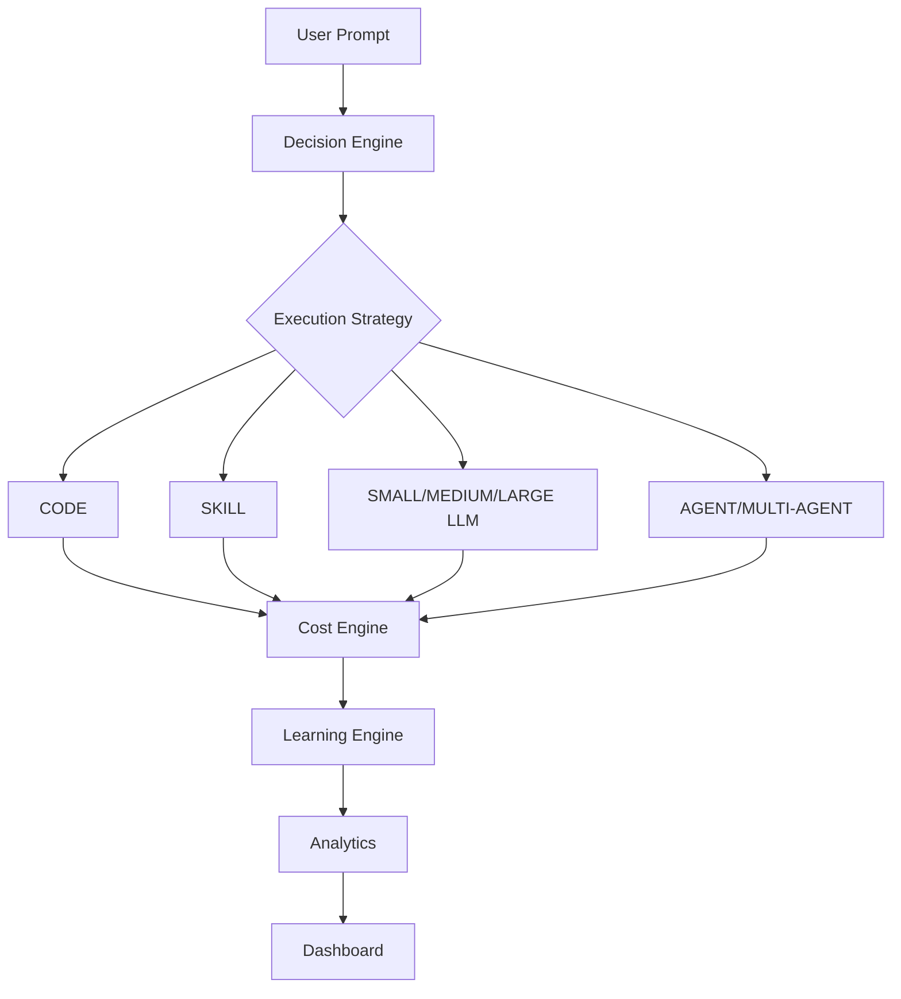
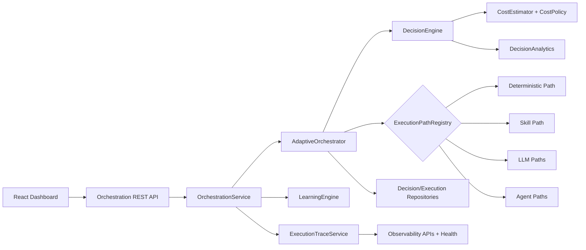
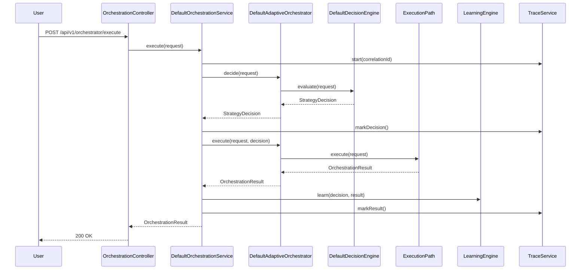

# Adaptive AI Orchestrator (AIO)

Enterprise orchestration platform that routes each request to the cheapest acceptable execution path:

- `DETERMINISTIC_CODE`
- `AI_SKILL`
- `SMALL_LLM`
- `MEDIUM_LLM`
- `LARGE_LLM`
- `SINGLE_AGENT`
- `MULTI_AGENT_WORKFLOW`

The key outcome is measurable savings versus always using agents, while preserving confidence and latency guardrails.

## What Was Improved

- End-to-end orchestration flow implemented (`Controller -> Service -> Orchestrator -> Decision -> Execution Path -> Cost/Learning/Analytics`).
- Duplicate logic reduced with centralized cost estimation and shared strategy contracts.
- Dependency injection hardened with concrete adapters for every interface.
- Structured logging added across decision and execution events.
- Validation and global exception handling added for API reliability.
- Correlation IDs, execution tracing, metrics, and health indicators added for observability.
- Analytics and scenario benchmarking APIs added.
- React dashboard upgraded with live flow, decision scoring, savings, and benchmark views.
- Test coverage added for decision routing, orchestration APIs, and integration flow.

## Architecture

### End-to-End Flow



### Component Diagram



### Sequence (Request Execution)



## Why Skills vs Agents Works

- Skills are reusable, stateless, and low-latency: ideal for tasks like summarization, classification, email drafting, formatting.
- Agents are expensive due to iterative reasoning, planning loops, memory/tool orchestration, and retries.
- The decision engine enforces cheapest-acceptable routing first, and only escalates to large models/agents when complexity or quality risk requires it.
- Scenario APIs expose savings versus always-agent routing.

## Project Structure

```text
adaptive-ai-orchestrator/
  backend/src/main/java/com/aio/orchestrator/
    controller/                # REST adapters + exception advice
    service/                   # Use-case orchestration service
    orchestrator/              # Decision + execution coordination
    decision/                  # Decision interfaces + heuristic implementations
    cost/                      # Cost policy + estimator
    skills/                    # Skill contracts + runtime implementations
    llm/                       # LLM gateway contracts + implementations
    agents/                    # Agent runtime contracts + implementations
    repository/                # Replaceable persistence interfaces + in-memory adapters
    analytics/                 # Summary analytics + learning engine
    telemetry/                 # Structured logs, correlation, health
    model/                     # Domain models
    config/                    # Configuration properties + web config
  frontend/src/
    features/orchestration/    # Dashboard feature
    shared/contracts/          # API contracts
```

## API Reference

Base URL: `http://localhost:8080/api/v1/orchestrator`

### Execution

- `POST /execute`
- Body:

```json
{
  "tenantId": "enterprise-tenant",
  "userId": "architect-user",
  "payload": "Draft an executive email summary",
  "metadata": {
    "category": "email",
    "difficulty": "easy"
  }
}
```

### Analytics

- `GET /analytics/summary`
- `GET /analytics/paths`
- `GET /analytics/history?limit=50`
- `GET /analytics/learning?limit=50`
- `GET /analytics/scenarios`

### Observability

- `GET /observability/traces?limit=20`
- `GET /observability/traces/{requestId}`
- `GET /observability/metrics`
- `GET /actuator/health`

## Demo Scenarios Included

- Scenario 1: Simple JSON validation -> `DETERMINISTIC_CODE`
- Scenario 2: Email drafting -> `AI_SKILL`
- Scenario 3: Research question -> `LARGE_LLM`
- Scenario 4: Travel planning -> `SINGLE_AGENT`
- Scenario 5: Enterprise migration planning -> `MULTI_AGENT_WORKFLOW`

Each scenario returns:

- reason for routing
- estimated vs actual cost
- estimated vs actual latency
- token usage
- savings compared to always using agents

## Run Locally

### Backend (Java 21 + Maven)

```powershell
$env:JAVA_HOME="C:\path\to\jdk-21"
$env:Path="$env:JAVA_HOME\bin;$env:Path"
mvn clean install
mvn spring-boot:run
```

### Frontend

```powershell
cd frontend
npm install
npm run build
npm run dev
```

## Verification Status

- `mvn clean install`: passing
- Backend unit/integration tests: passing
- `npm run build`: passing
- Dashboard preview HTTP probe: `200 OK` with root element detected

## Notes

- In this repository snapshot, persistence adapters are in-memory for deterministic integration verification.
- PostgreSQL/Redis/Kafka connectors are replaceable via existing interfaces and can be swapped without changing controller/service contracts.
