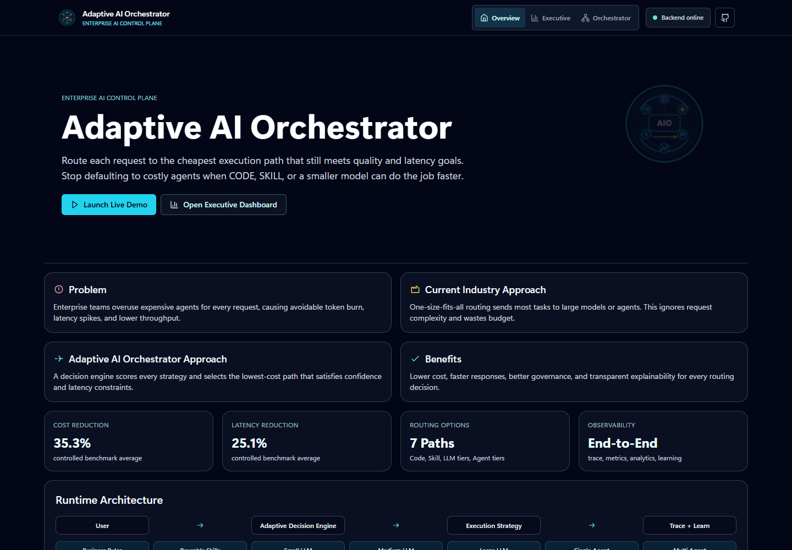
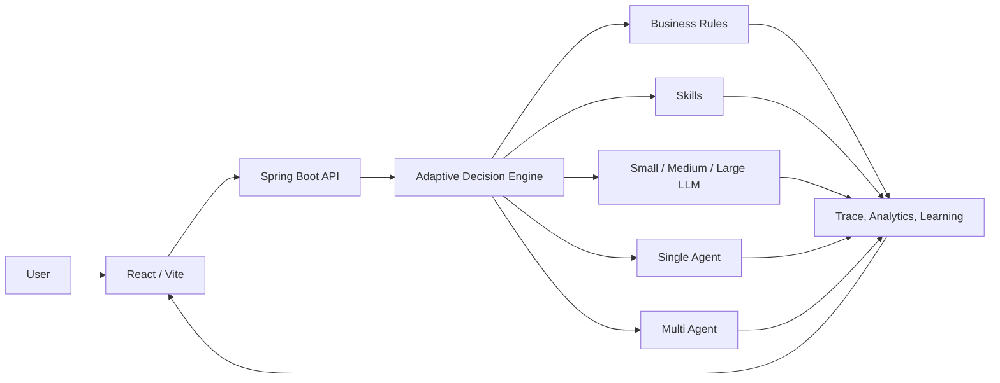
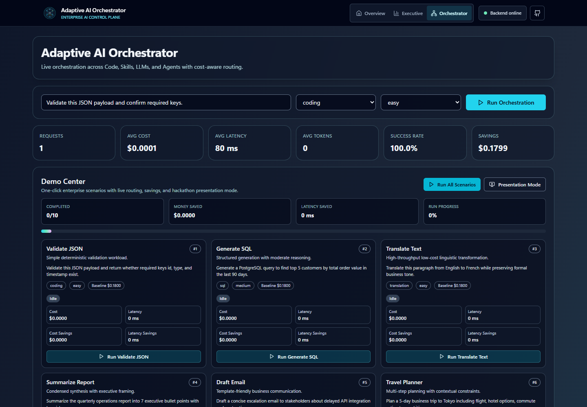
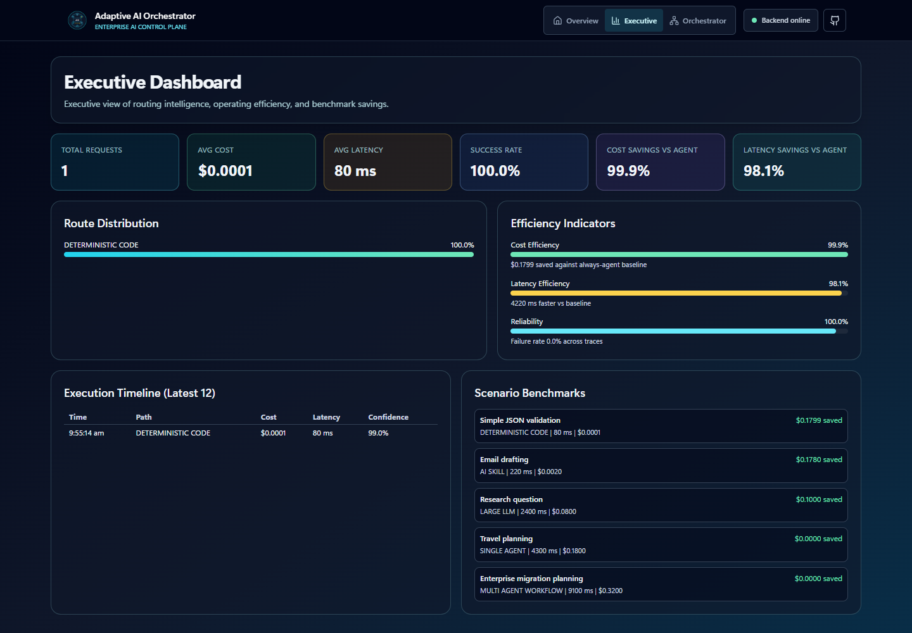

# Adaptive AI Orchestrator

Adaptive AI Orchestrator is a cost-aware enterprise AI control plane. It evaluates each request and selects the lowest-cost execution strategy that still satisfies quality, confidence, latency, and policy requirements.


The hackathon prototype preserves a clean orchestration architecture across deterministic business rules, reusable skills, simulated LLM tiers, single-agent reasoning, and multi-agent workflows. It is self-contained and does not require model credentials, cloud databases, or paid APIs.

## Hackathon Narrative



## Demo Access

| Service | Target URL | Status |
|---|---|---|
| Frontend | `https://adaptive-ai-orchestrator.vercel.app` | Deployment-ready; created from the Vercel account |
| Backend | `https://adaptive-ai-orchestrator.onrender.com` | Deployment-ready; created from the Render account |
| Health | `https://adaptive-ai-orchestrator.onrender.com/health` | Available after backend deployment |

See [deployment.md](deployment.md) for the exact free-tier deployment and verification procedure. Platform names are globally shared, so the final hostname can differ if a requested name is already taken.

## Business Value

Controlled prototype trials across representative workloads produced:

| Metric | Observed result |
|---|---:|
| Executions | 15 across 3 repeated trials |
| Average execution cost | `$0.1800` baseline to `$0.1164` adaptive |
| Cost reduction | `35.3%` |
| Average latency | `4.30 s` baseline to `3.22 s` adaptive |
| Latency reduction | `25.1%` |
| Controlled demo success | `100%` |
| Average confidence | `94%` |
| Projected savings at 1M similar requests | `$63.6K` |

These are reproducible prototype measurements from deterministic local adapters, not production provider invoices or guaranteed future returns. The full methodology, raw trial summaries, formulas, and claim boundaries are documented in [Business Impact Evidence](docs/BUSINESS_IMPACT_EVIDENCE.md).

## Architecture



The detailed component, request-sequence, and cloud-deployment diagrams are in [Architecture](docs/ARCHITECTURE.md).

## Adaptive Decision Engine

For every request, the engine:

1. Normalizes the request and creates request and correlation identifiers.
2. Classifies task complexity from prompt signals and optional metadata.
3. Ranks all eligible execution strategies.
4. Estimates cost, latency, token usage, and confidence.
5. Applies configured policy, quality, and confidence gates.
6. Selects the lowest-cost acceptable route.
7. Executes through the existing path registry.
8. Records the rationale, rejected alternatives, trace, analytics, and learning snapshot.

The engine does not choose the cheapest route blindly. A more capable strategy is selected when a lower-cost candidate cannot satisfy the request constraints.

### Execution Strategies

- `DETERMINISTIC_CODE`
- `AI_SKILL`
- `SMALL_LLM`
- `MEDIUM_LLM`
- `LARGE_LLM`
- `SINGLE_AGENT`
- `MULTI_AGENT_WORKFLOW`

## Product Experience

- SaaS-style landing, executive, and live-orchestrator routes
- Responsive dark enterprise interface with accessible keyboard focus
- Sample enterprise prompts and one-click demo scenarios
- Animated request-to-route decision visualization
- Confidence, cost, latency, tokens, and savings dashboards
- Explainable routing rationale and evaluated-strategy scores
- Execution history, request timeline, trace steps, and route distribution
- Loading indicators, success/error toasts, and cloud backend status
- Render cold-start guidance and health retry
- GitHub source link and reviewer-friendly footer

### Screenshots

| Overview | Live Orchestration |
|---|---|
|  |  |



## Technology Stack

| Layer | Technology |
|---|---|
| Backend | Java 21, Spring Boot 3.3, Maven |
| Frontend | React 18, TypeScript, Vite 8, Tailwind CSS |
| Routing | React Router |
| Operations | Actuator, structured logs, correlation IDs, health checks |
| CI/CD | GitHub Actions |
| Backend hosting | Render Free web service with Docker |
| Frontend hosting | Vercel Hobby static deployment |
| Prototype storage | Thread-safe in-memory repositories |

PostgreSQL, Redis, and Kafka dependencies represent planned production adapters. They are disabled in the production demo profile and are not required to run or deploy the prototype.

## Local Setup

### Required Tools

- JDK 21
- Maven 3.9+
- Node.js 22+
- Git

### Windows Quick Start

Start the backend and frontend in separate terminals:

```text
run-backend-local.cmd
run-frontend-local.cmd
```

Open `http://127.0.0.1:5173/`.

### Manual Start

Backend:

```bash
cd backend
mvn spring-boot:run -Dspring-boot.run.profiles=prod
```

Frontend:

```bash
cd frontend
npm ci
npm run dev
```

The frontend defaults to `http://localhost:8080` when `VITE_API_BASE_URL` is not set.

## Cloud Deployment

The repository is ready for Git-connected automatic deployments:

1. Connect the repository to Render as a Blueprint. Render uses `render.yaml` and `backend/Dockerfile`.
2. Connect the repository to Vercel with root directory `frontend`.
3. Set `VITE_API_BASE_URL` to the deployed Render origin.
4. Verify `/health`, `/actuator/health`, `/executive`, and `/orchestrator`.

No paid service is configured. Read [Free Cloud Deployment Guide](deployment.md) before deploying, especially the free-tier cold-start and usage notes.

## Environment Configuration

Copy values from [.env.example](.env.example) and [frontend/.env.example](frontend/.env.example).

Key variables:

| Variable | Default or example | Purpose |
|---|---|---|
| `PORT` | `8080` locally; supplied by Render | Backend listener port |
| `SPRING_PROFILES_ACTIVE` | `prod` | Production demo configuration |
| `AIO_CORS_ALLOWED_ORIGIN_PATTERNS` | Localhost and `*.vercel.app` | Trusted browser origins |
| `AIO_MAX_ACCEPTABLE_COST_USD` | `0.25` | Routing cost gate |
| `AIO_MIN_CONFIDENCE_THRESHOLD` | `0.72` | Routing confidence gate |
| `AIO_MAX_ACCEPTABLE_LATENCY_MS` | `5500` | Routing latency gate |
| `VITE_API_BASE_URL` | Render service origin | Frontend API origin |

## API Documentation

Base path: `/api/v1/orchestrator`

| Method | Endpoint | Purpose |
|---|---|---|
| `POST` | `/execute` | Execute a request through adaptive routing |
| `GET` | `/analytics/summary` | Aggregate execution analytics |
| `GET` | `/analytics/paths` | Route usage distribution |
| `GET` | `/analytics/history?limit=50` | Recent execution history |
| `GET` | `/analytics/learning?limit=50` | Recent learning snapshots |
| `GET` | `/analytics/scenarios` | Deterministic benchmark scenarios |
| `GET` | `/observability/traces?limit=20` | Recent execution traces |
| `GET` | `/observability/traces/{requestId}` | Trace for one request |
| `GET` | `/observability/metrics` | Trace-derived operational metrics |
| `GET` | `/health` | Lightweight platform health |
| `GET` | `/actuator/health` | Spring Boot Actuator health |

Example request:

```json
{
  "tenantId": "enterprise-tenant",
  "userId": "architect-user",
  "payload": "Draft an executive email summary",
  "metadata": {
    "category": "email",
    "difficulty": "easy"
  }
}
```

`metadata` is optional. The classifier can infer route signals from the payload; metadata provides explicit context when an upstream application already knows it.

## Production Readiness

- Environment-driven port, CORS, routing policy, logging, and frontend API origin
- Graceful Spring Boot shutdown and Render shutdown allowance
- GZIP response compression and forwarded-header support
- Global structured API errors with correlation IDs
- Request-size and query-limit validation
- Security headers on backend and frontend responses
- Public and Actuator health endpoints
- Non-root, memory-aware Java 21 runtime container
- SPA deep-link rewrites for Vercel
- Locked frontend dependencies with zero known npm audit findings
- Backend tests and frontend production build on every push

## CI/CD

`.github/workflows/ci.yml` runs two independent jobs for every push and pull request:

- `mvn verify` on Java 21
- `npm ci`, `npm audit --audit-level=high`, and `npm run build` on Node 22

Render deploys after checks pass. Vercel creates production or preview deployments from the connected Git branch.

## Hackathon Highlights

- Demonstrates runtime selection rather than static model routing
- Combines deterministic, model, and agent execution behind one contract
- Makes every selection explainable and observable
- Quantifies prototype cost and latency impact with repeatable evidence
- Runs without external credentials, reducing judge setup risk
- Deploys entirely on free infrastructure for browser-only evaluation
- Preserves extension points for enterprise models, skills, agents, policies, and governance

## Current Prototype Boundaries

- Model and agent paths are deterministic demo adapters, not live provider calls.
- Analytics and learning history are in memory and reset on service restart.
- Free Render instances sleep after inactivity, so the first request can be slow.
- Authentication, tenant isolation, persistent storage, budgets, and enterprise policy administration are roadmap capabilities.
- Vercel Hobby use must remain consistent with its current non-commercial terms and organizational policy.

## Roadmap

- Register enterprise model providers, tools, skills, and agents
- Persist execution history in PostgreSQL
- Add Redis caching and Kafka event streaming
- Introduce tenant isolation, RBAC, budget policies, and model allowlists
- Add data-sensitivity routing and compliance controls
- Train route optimization from outcome quality and user feedback
- Add production SLOs, distributed tracing, and provider failover

## Repository Structure

```text
backend/                    Spring Boot API and orchestration runtime
frontend/                   React/Vite enterprise experience
.github/workflows/ci.yml    Build, test, audit, and package pipeline
docs/                       Architecture and business-impact evidence
outputs/demo-video/         Project overview video, deck, and submission assets
render.yaml                 Render Blueprint
deployment.md               Free cloud deployment runbook
```

## Submission Assets

- `outputs/demo-video/adaptive-ai-orchestrator-project-overview.mp4`
- `outputs/demo-video/adaptive-ai-orchestrator-project-overview.pptx`
- `outputs/demo-video/cloud-demo/demo.mp4` - 4:12 live browser walkthrough with narration
- `outputs/demo-video/adaptive-ai-orchestrator-cover-page.png`
- `outputs/demo-video/adaptive-ai-orchestrator-logo-100.png`
- `docs/BUSINESS_IMPACT_EVIDENCE.md`

## Intellectual Property Notice

This repository is shared for authorized hackathon evaluation. No open-source license is granted. Reuse, redistribution, or commercial use requires permission from the project owner and must follow applicable HCLTech intellectual-property policies.
