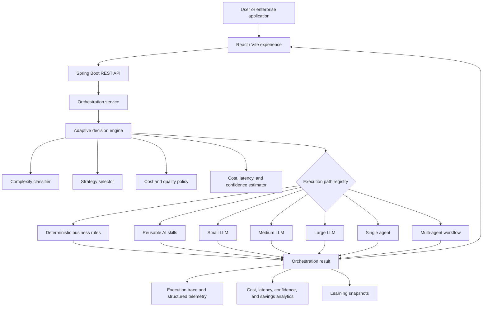
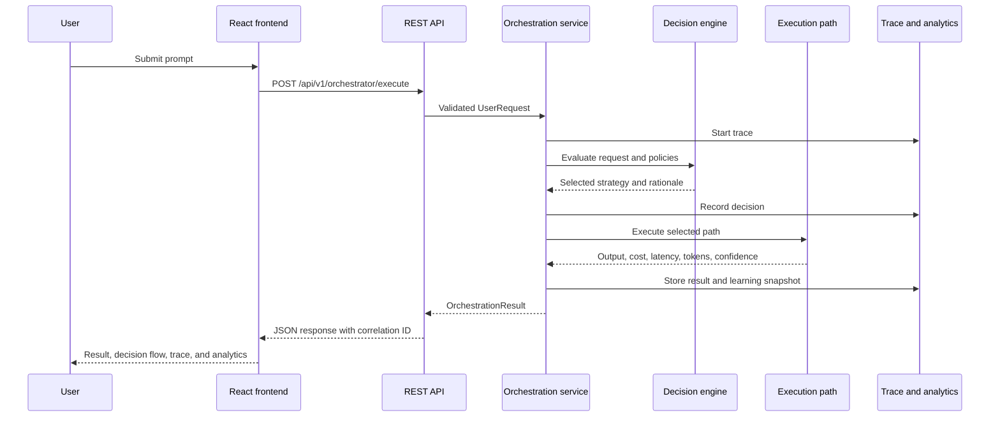
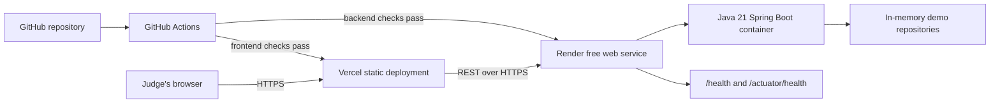

# Adaptive AI Orchestrator Architecture

## Runtime Architecture

The decision engine evaluates every candidate strategy and selects the lowest estimated cost among the routes that satisfy configured quality, confidence, latency, and policy constraints. It does not default to the cheapest route when that route is unsuitable.

## Request Lifecycle

## Cloud Deployment

The free deployment intentionally preserves the prototype's in-memory stores. Execution history resets whenever the Render service restarts, redeploys, or wakes on a fresh instance. PostgreSQL, Redis, and Kafka remain future production adapters rather than hidden runtime dependencies.

## Architectural Boundaries

- Controllers validate and expose the existing REST contracts.
- The orchestration service owns request normalization, trace lifecycle, result recording, and learning updates.
- The decision package owns classification, scoring, policy gates, and route selection.
- Execution paths isolate deterministic rules, skills, model gateways, and agent coordinators.
- In-memory repositories support a self-contained hackathon demo without credentials or paid infrastructure.
- Telemetry and analytics expose explainable routing, health, cost, latency, confidence, tokens, and savings.
